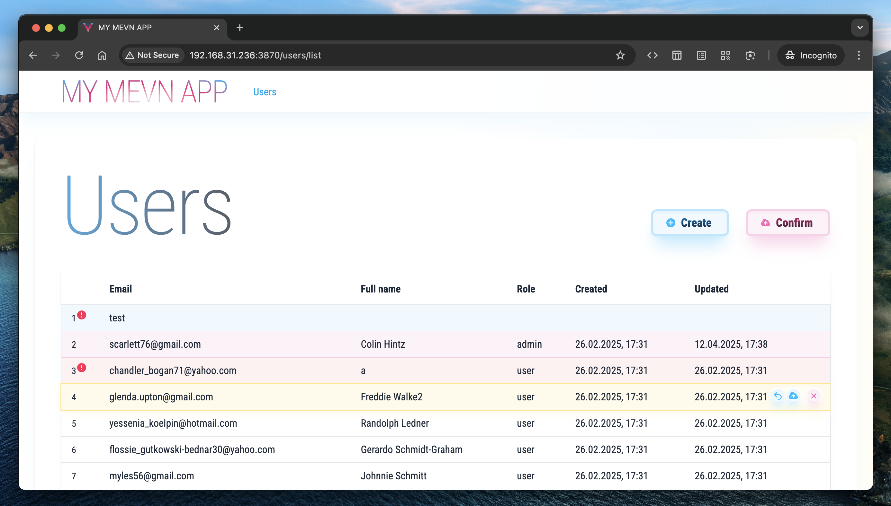
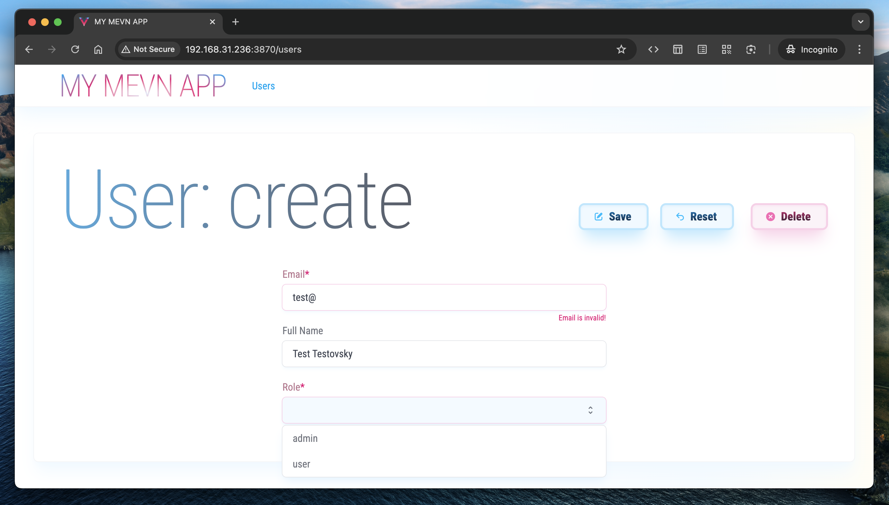
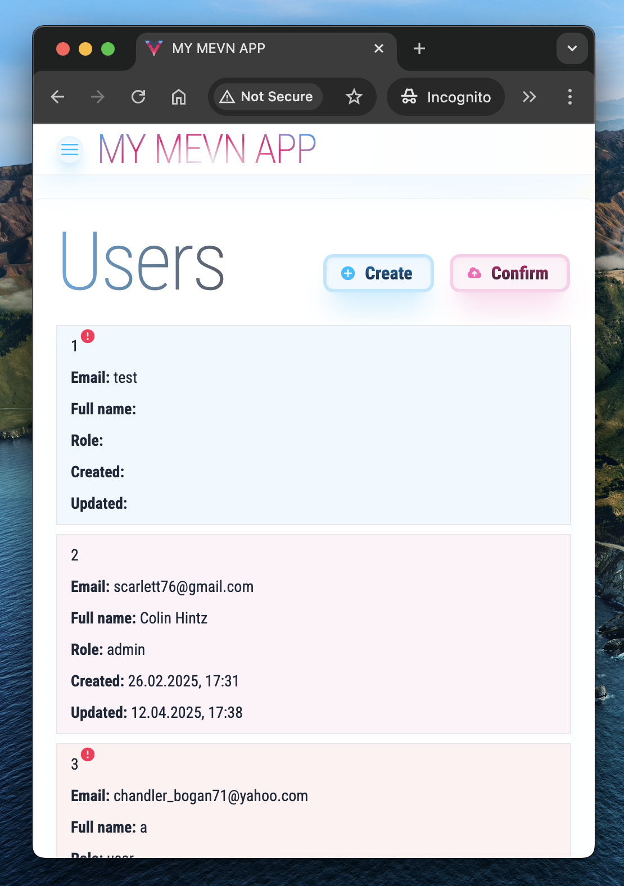

# My MEVN CRUD App (Client + Server)

— MongoDB, Express, Vue, Node;  
— Vite, Vitest, Cypress, TailwindCSS;  
— Client and Server _both_ use Vite and share the same package.json, .env, etc;  
— Custom responsive design.

## Project Setup

```sh
yarn
```

### Compile and Hot-Reload for Development

```sh
yarn dev
```

### Type-Check, Compile and Minify for Production

```sh
yarn build
```

### Run Unit & Integration Tests with [Vitest](https://vitest.dev/)

```sh
yarn test
```

### Coverage with [Vitest](https://vitest.dev/)

```sh
yarn coverage
```

### Run End-to-End Tests with [Cypress](https://www.cypress.io/)

Development server:

```sh
yarn test:e2e:dev
```

Production build:

```sh
yarn build
yarn test:e2e
```

### Prepare MongoDB with Docker

Development:

```sh
yarn prepare:mongo:dev
```

Production:

```sh
yarn prepare:mongo:prod
```

### Prepare Admin User for Development

```sh
yarn prepare:seed:admin
```

Check package.json scripts for more.

### Screenshots




